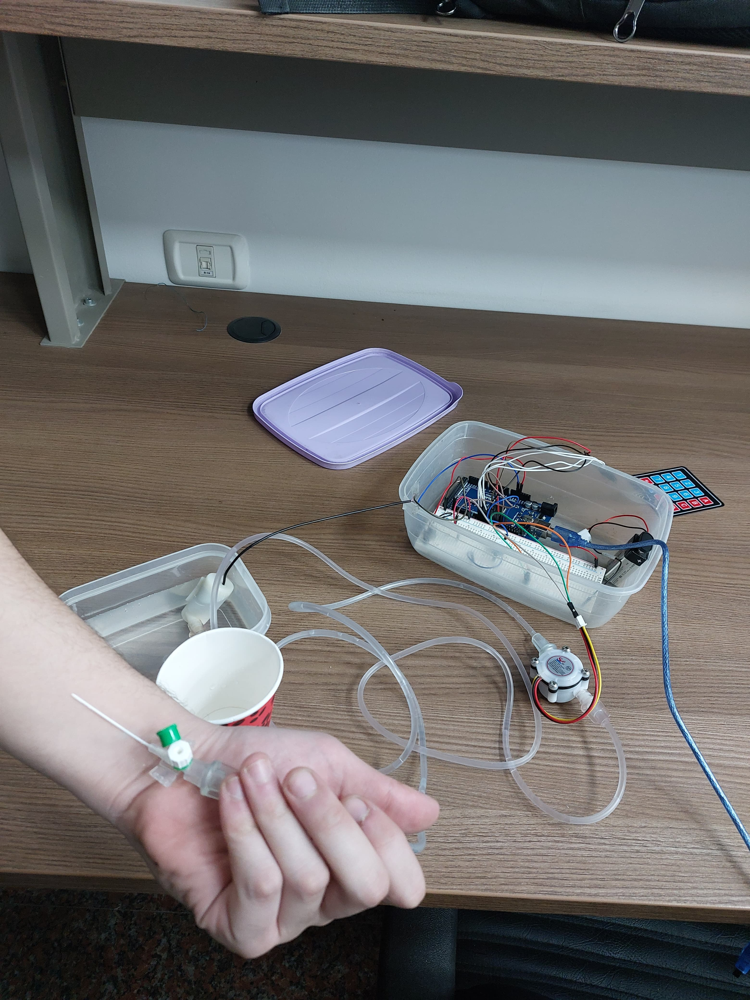

# Arduino-Based Infusion Pump with Drug Library and Occlusion Detection

## Contents

- [Overview](#overview)
- [Key Features](#key-features)
- [Modes of Operation](#modes-of-operation)
- [System Components](#system-components)
- [Contributors](#contributors)

## Overview

<video width="720" height="480" controls>
  <source src="Illustration_Vid.mp4" type="video/mp4">
  Sorry, your browser does not support embedded videos. You can <a href="Illustration_Vid.mp4">download the video here</a>.
</video>

This project presents an **Arduino-based infusion pump** with an integrated **drug library feature**. Designed to ensure safe and accurate delivery of intravenous fluids and medications, this system supports two operational modes: manual input of the flow rate or automatic calculation based on drug selection and patient age. 

Key safety features include occlusion detection, which triggers a buzzer alarm in case of flow blockage, and precise control of the infusion rate using a pump and flow sensor. The infusion pump system is ideal for clinical settings, ensuring accurate medication delivery and patient safety.

  

The modular design combines affordability with essential functionality, offering an intuitive interface for healthcare providers to manage infusion parameters effectively.

 

  

 

---

## Key Features

- **Dual Operational Modes**:
  - Manual entry of flow rate for user-defined control.
  - Automatic flow rate calculation using the drug library and patient age input.
  
- **Drug Library Integration**:  
  - Supports three pre-programmed drugs with preset safe dosage ranges.  
  - Automatically adjusts flow rates based on patient age to ensure precision and compliance with dosing guidelines.

- **Occlusion Detection**:  
  - Real-time monitoring using a flow sensor.  
  - Alerts through a buzzer alarm and LED indication when occlusion is detected.

- **Accurate Flow Rate Control**:  
  - Uses a pump driven by a BJT transistor circuit to achieve smooth and precise flow regulation.

- **User-Friendly Interface**:  
  - Simplified input for flow rate, drug selection, and patient age.  
  - Visual and auditory feedback for error handling and status updates.

---

## Modes of Operation

1. **Manual Mode**:  
   - The user inputs the desired flow rate (in mL/h).  
   - The pump operates at the specified rate, monitored by the flow sensor for accuracy.

2. **Automatic Mode**:  
   - The user selects one of three pre-set drugs from the library.  
   - After specifying the patient’s age, the system calculates the appropriate flow rate based on dosage guidelines.  
   - The pump automatically adjusts to the calculated rate.

---

## System Components

- **Pump**: Mechanism for controlled fluid delivery.
- **Flow Sensor**: Monitors the fluid flow rate in real-time for accuracy and occlusion detection.
- **BJT Transistor**: Controls the motor driving the pump for precise flow regulation.
- **Buzzer**: Emits an audible alarm in case of occlusion or errors.
- **Arduino**: Microcontroller for managing inputs, calculations, and outputs.
- **Drug Library**: Pre-programmed database of three drugs with dosage parameters based on patient age.

---

## Contributors

- **Ibrahim Fateen**  
  [LinkedIn](https://www.linkedin.com/in/ibrahim-fateen-a93b411ab/)

- **Youssef Abo-El-Ela**  
  [LinkedIn](https://www.linkedin.com/in/youssef-abo-el-ela-a4a12b235/)

- **Ali Younis**  
  [LinkedIn](https://www.linkedin.com/in/ali-younis-98b780277/)

- **Omar Khaled**  
  [LinkedIn](https://www.linkedin.com/in/omar-khaled-064b7930a/)

---
